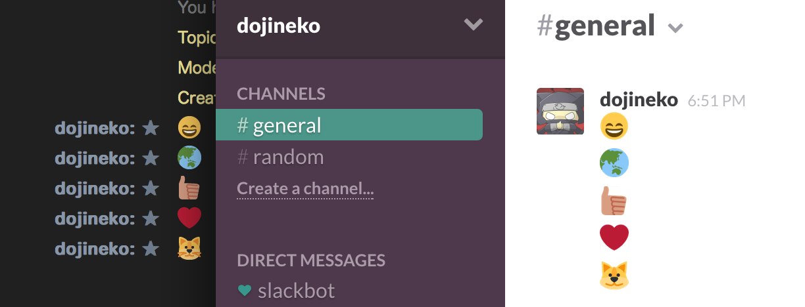

nicemoji
========


`:smile:` のようなGithubで使える絵文字を LimeChat for Mac で表示可能にするJavaScriptです。  
Slackのオリジナル絵文字、Twitterスタイルにも対応してます。

## How to Use
リポジトリ内の `nicemoji.js` をご利用中のテーマファイルの名前に合わせてリネームし、  
同じ階層に配置してください。

```
~/Library/Application Support/LimeChat/Themes/ ……… LimeChatのテーマディレクトリ
│
├ Limelight.css ……… nicemoji を適用したいテーマファイル
└ Limelight.js  ……… リネームした nicemoji.js
```

設置後は LimeChat を起動するか、すでに起動している場合は `Reload Theme (⌘+*)` でテーマをリロードしてください。  
正しく設置できていれば `:smile:` と送信すると :smile: で表示されます。

利用可能な絵文字は [EMOJI CHEAT SHEET](http://www.emoji-cheat-sheet.com/) を参考にしてみてください。

## Settings
nicemoji ではいくつかの設定を行うことができます。  
JavaScript本体の先頭に定数が定義されています。

| 定数名                 | デフォルト     | 効果                                                                                          |
| ---------------------- |:--------------:| --------------------------------------------------------------------------------------------- |
| ADD_EMOJI_BASE_CSS     | true           | 絵文字を表示するのに必要なスタイルを適用します。                                              |
| ADD_EMOJI_SHADOW       | false          | 絵文字にドロップシャドウを設定します。<br>`EMOJI_SHADOW_COLOR` で指定した色の影が付きます。   |
| EMOJI_SIZE             | 1.5em          | 絵文字のサイズを指定します。                                                                  |
| EMOJI_SHADOW_COLOR     | #DDDDDD        | `ADD_EMOJI_SHADOW` が `true` の時に表示される影の色を指定します。                             |
| EMOJI_STYLE            | twitter        | 絵文字のテーマを指定します。<br>`twitter` か `github` を指定することができます。              |
| SLACK_API_TOKEN        | (null)         | Slackのオリジナル絵文字を利用する場合にSlack API Tokenを指定します。                          |

## FAQ
### なんて読むの？
「にせもじ」「ナイスもじ」読みやすい方でどうぞー :cat:

### nicemoji を有効にしたら表示が崩れた
nicemoji が追加するスタイルが影響している場合は `ADD_EMOJI_BASE_CSS` を `false` にすることで  
デフォルトのスタイルを無効にすることができます。その場合は別途テーマで絵文字のスタイルを調整してください。

### Slackの絵文字が出ない
`SLACK_API_TOKEN` が正しく設定されているか確認して下さい。  
Slack API Token は https://api.slack.com/web から取得できます。

## License
MIT
